## Links between nodes

### A link with arrow head
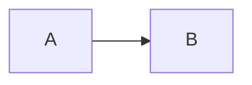

### An open link
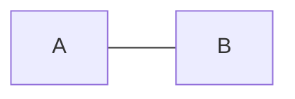

### Text on links
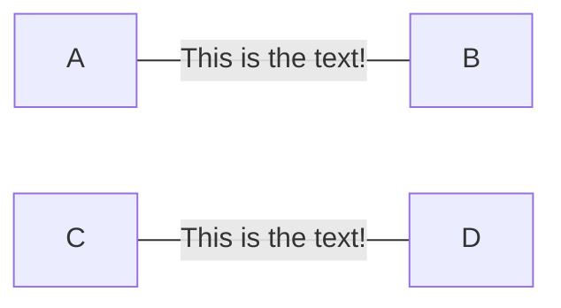

### A link with arrow head and text
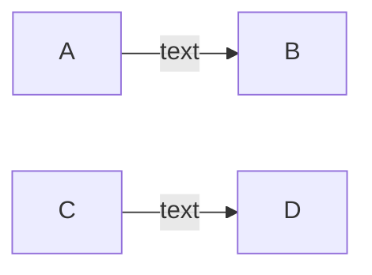

### Dotted link
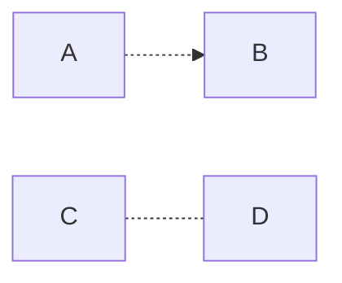

### Dotted link with text
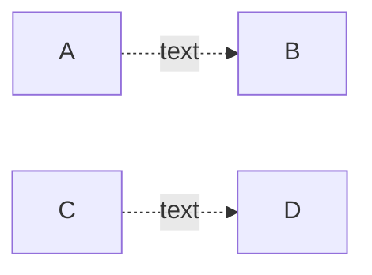

### Thick link
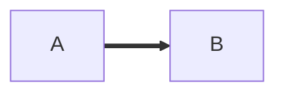

### Thick link with text
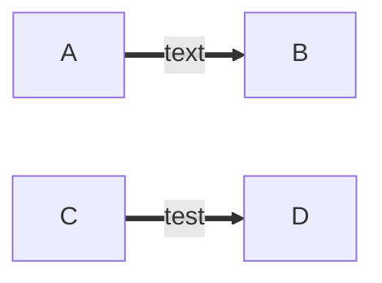

### An invisible link
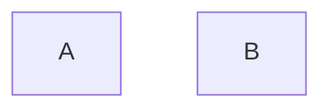

### Chaining of links
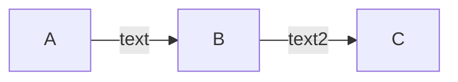

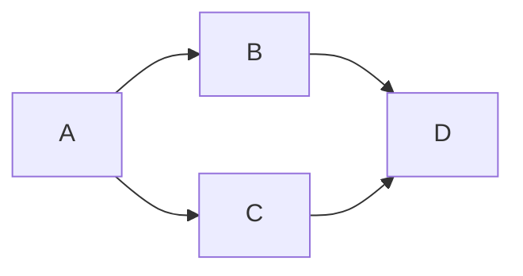

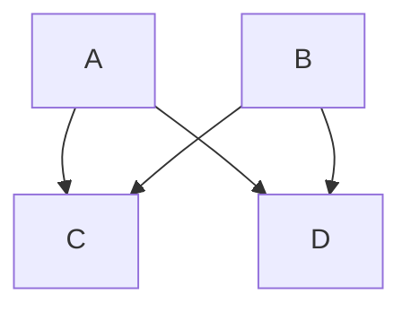

### New arrow types
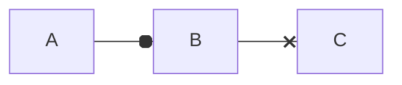

### Multi directional arrows
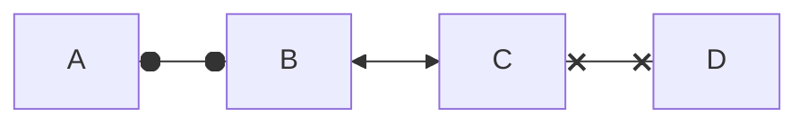

### Minimum length of a link
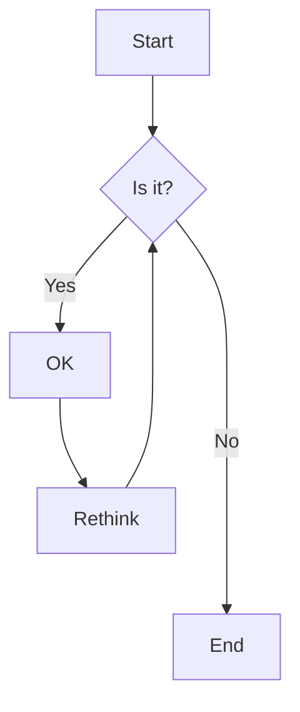

