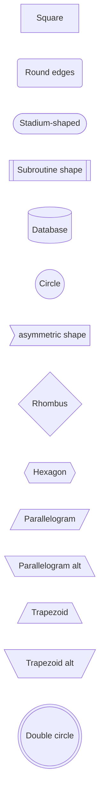

## Node shapes

```mermaid
flowchart LR
    id1[Square]
    id2(Round edges)
    id3([Stadium-shaped])
    id4[[Subroutine shape]]
    id5[(Database)]
    id6((Circle))
    id7>asymmetric shape]
    id8{Rhombus}
    id9{{Hexagon}}
    id10[/Parallelogram/]
    id11[\Parallelogram alt\]
    id12[/Trapezoid\]
    id13[\Trapezoid alt/]
    id14(((Double circle)))
```
