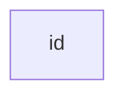
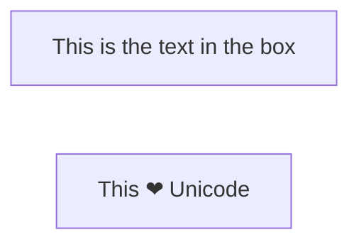
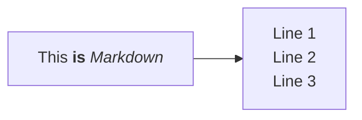

## Node

### ノード

```mermaid
flowchart LR
    id
```

### テキスト付きノード

```mermaid
flowchart LR
    id1[This is the text in the box]
    id2["This ❤ Unicode"]
```

### マークダウン書式

```mermaid
%%{init: {"flowchart": {"htmlLabels": false}} }%%
flowchart LR
    markdown["`This **is** _Markdown_`"]
    newLines["`Line 1
    Line 2
    Line 3`"]
    markdown --> newLines
```
