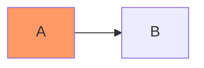
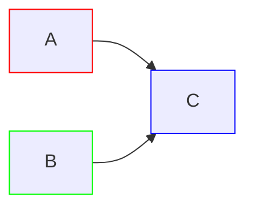

## Styling and classes

### Styling a node

```mermaid
flowchart LR
    id1(Start)-->id2(Stop)
    style id1 fill:#f9f,stroke:#333,stroke-width:4px
    style id2 fill:#bbf,stroke:#f66,stroke-width:2px,color:#fff,stroke-dasharray: 5 5
```

`:::`でノードにクラス名を付ける。

```mermaid
flowchart LR
    A:::someclass --> B
    classDef someclass fill:#f96
```

```mermaid
flowchart LR
    A:::foo & B:::bar --> C:::foobar
    classDef foo stroke:#f00
    classDef bar stroke:#0f0
    classDef foobar stroke:#00f
```

### CSS classes

TODO

