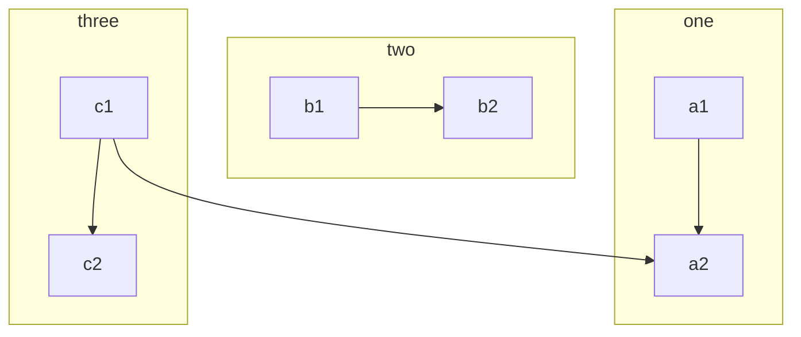
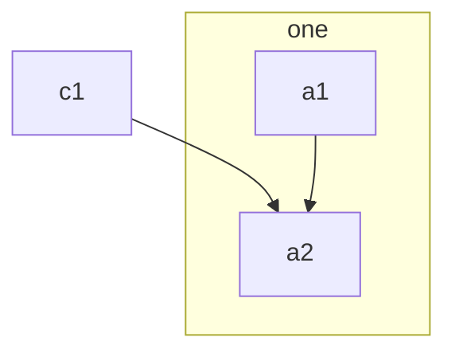
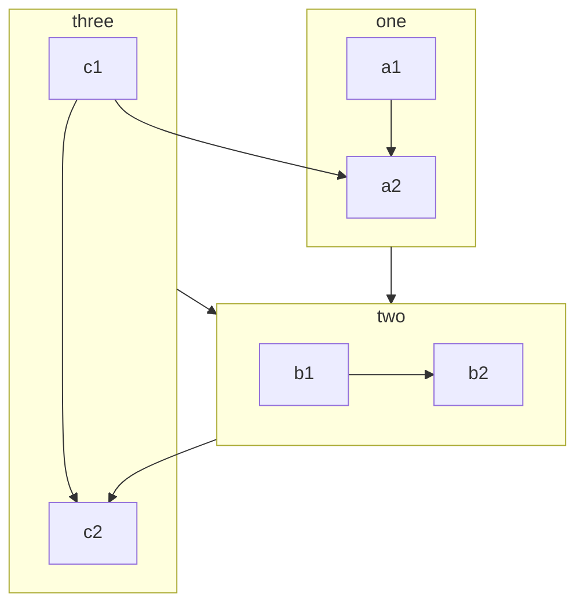
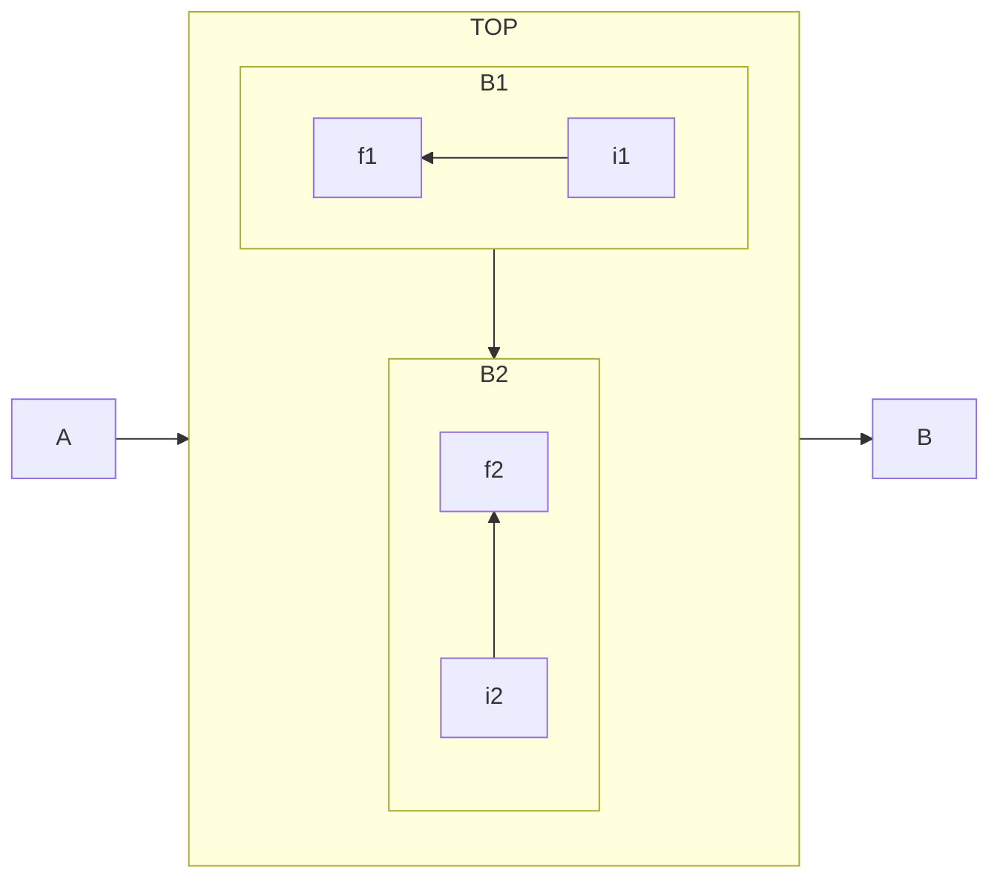
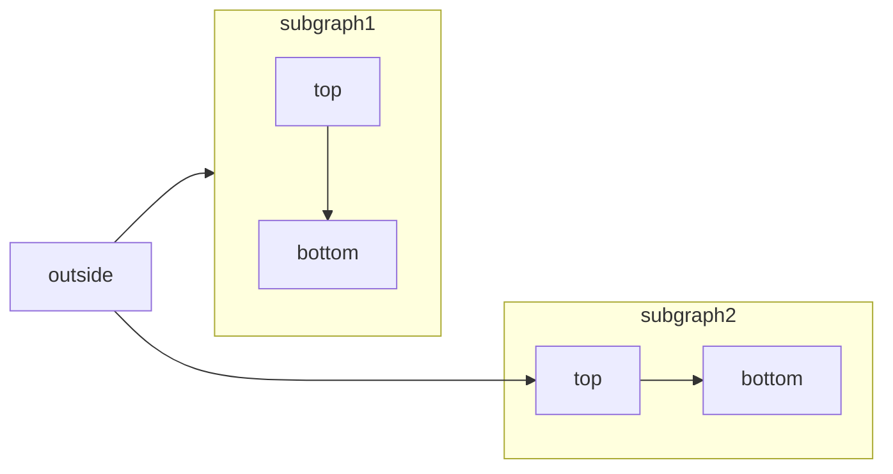

## Subgraphs

```mermaid
flowchart TB
    c1-->a2
    subgraph one
    a1-->a2
    end
    subgraph two
    b1-->b2
    end
    subgraph three
    c1-->c2
    end
```

サブグラフに明示的なIDを設定する。

```mermaid
flowchart TB
    c1-->a2
    subgraph ide1 [one]
    a1-->a2
    end
```

### flowcharts

```mermaid
flowchart TB
    c1-->a2
    subgraph one
    a1-->a2
    end
    subgraph two
    b1-->b2
    end
    subgraph three
    c1-->c2
    end
    one --> two
    three --> two
    two --> c2
```

### Direction in subgraphs

```mermaid
flowchart LR
  subgraph TOP
    direction TB
    subgraph B1
        direction RL
        i1 -->f1
    end
    subgraph B2
        direction BT
        i2 -->f2
    end
  end
  A --> TOP --> B
  B1 --> B2
```

サブグラフのノードが外部にリンクされている場合、サブグラフの方向は無視される。サブグラフは親グラフの方向を継承する：

```mermaid
flowchart LR
    subgraph subgraph1
        direction TB
        top1[top] --> bottom1[bottom]
    end
    subgraph subgraph2
        direction TB
        top2[top] --> bottom2[bottom]
    end
    %% ^ これらの部分グラフは、リンクを除いて同一である:

    %% Link *to* subgraph1: サブグラフ1の方向は維持される
    outside --> subgraph1
    %% Link *within* subgraph2:
    %% subgraph2は、トップレベル・グラフ(LR)の方向を継承する
    outside ---> top2
```
