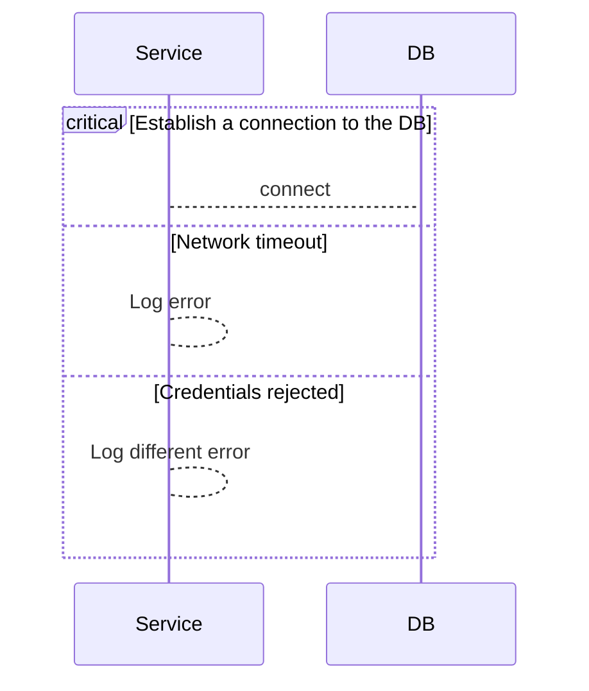
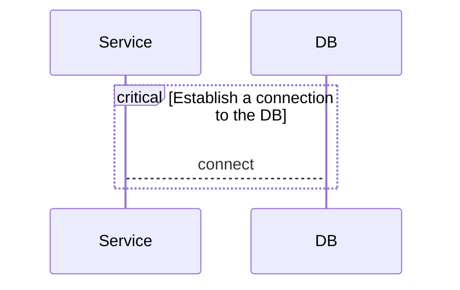
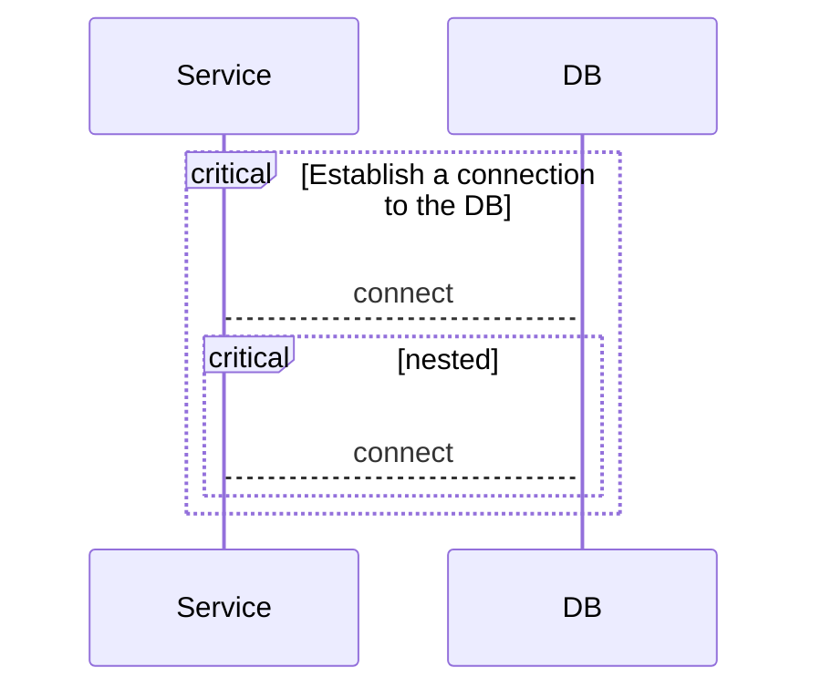

# Critical Region

```mermaid
sequenceDiagram
    critical Establish a connection to the DB
        Service-->DB: connect
    option Network timeout
        Service-->Service: Log error
    option Credentials rejected
        Service-->Service: Log different error
    end
```

オプションなし

```mermaid
sequenceDiagram
    critical Establish a connection to the DB
        Service-->DB: connect
    end
```

ネスト

```mermaid
sequenceDiagram
    critical Establish a connection to the DB
        Service-->DB: connect
        critical nested
            Service-->DB: connect
        end
    end
```
