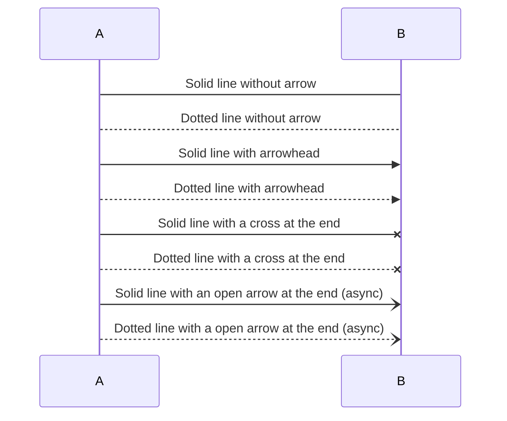

## Messages

```mermaid
sequenceDiagram
    A -> B: Solid line without arrow
    A --> B: Dotted line without arrow
    A ->> B: Solid line with arrowhead
    A -->> B: Dotted line with arrowhead
    A -x B: Solid line with a cross at the end
    A --x B: Dotted line with a cross at the end
    A -) B: Solid line with an open arrow at the end (async)
    A --) B: Dotted line with a open arrow at the end (async)
```
