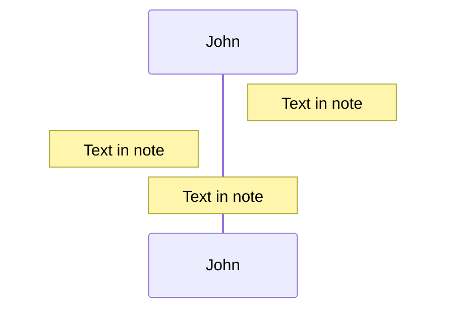
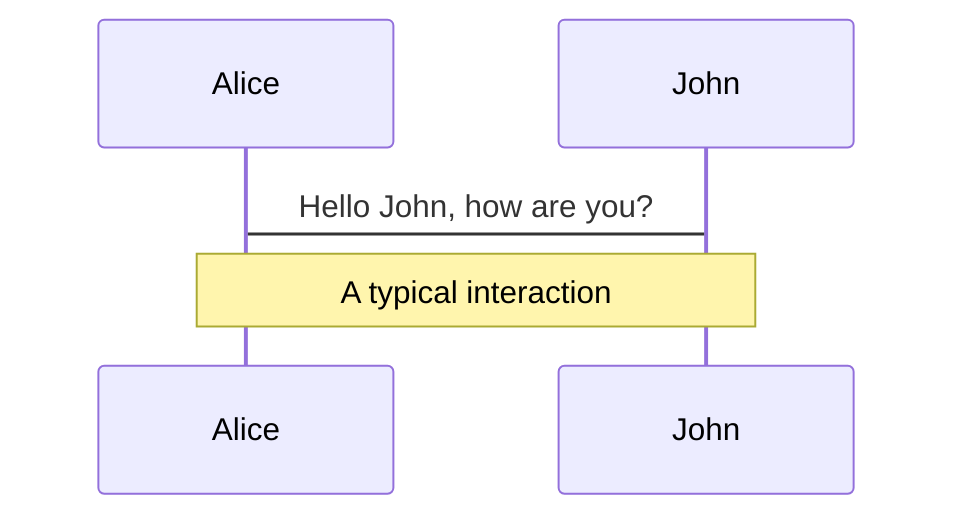
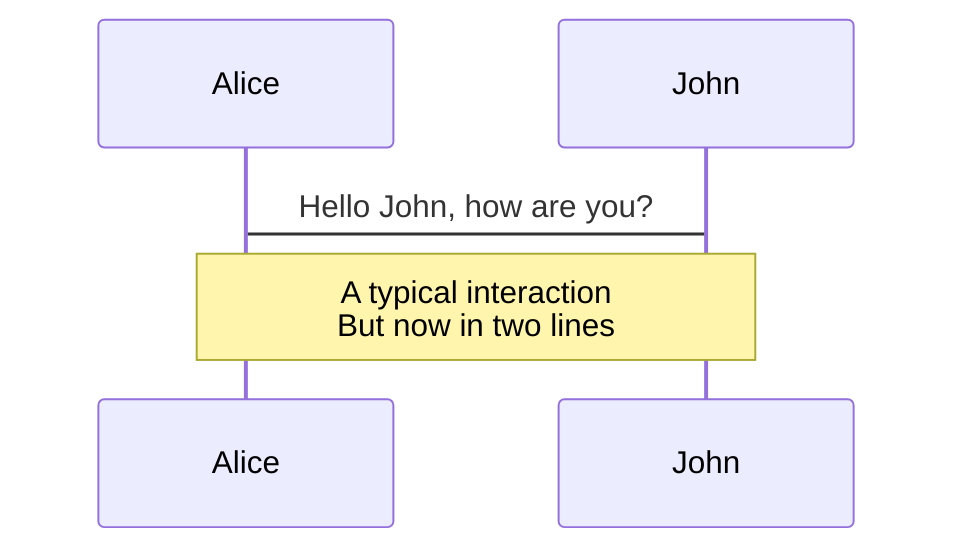

## Notes

```mermaid
sequenceDiagram
    participant John
    Note right of John: Text in note
    Note left of John: Text in note
    Note over John: Text in note
```

２つのparticipantにまたがるノート

```mermaid
sequenceDiagram
    Alice->John: Hello John, how are you?
    Note over Alice,John: A typical interaction
```

改行を追加

```mermaid
sequenceDiagram
    Alice->John: Hello John, how are you?
    Note over Alice,John: A typical interaction<br/>But now in two lines
```
