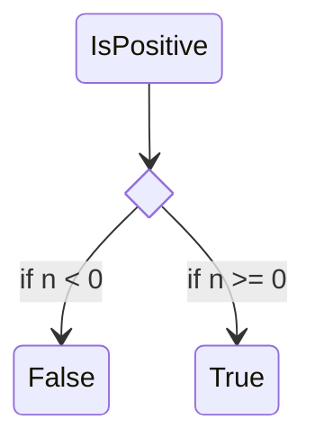

## Choice

２つ以上の経路から選択する必要がある場合は`<<choice>>`を使ってモデル化することができる。

```mermaid
stateDiagram-v2
    state if_state <<choice>>
    IsPositive --> if_state
    if_state --> False: if n < 0
    if_state --> True : if n >= 0
```
