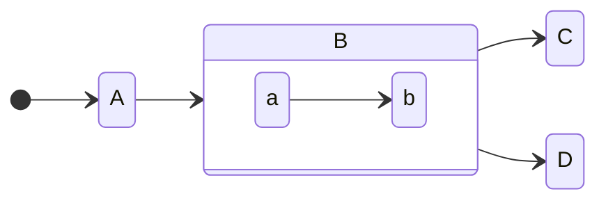

## Setting the direction of the diagram

direction文を使用して図の描画方向を設定することができる。

```mermaid
stateDiagram
    direction LR
    [*] --> A
    A --> B
    B --> C
    state B {
        direction LR
        a --> b
    }
    B --> D
```
