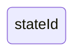
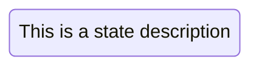

## States

### idだけで状態を定義する

```mermaid
stateDiagram-v2
    stateId
```

### 状態キーワードと説明を使う

```mermaid
stateDiagram-v2
    state "This is a state description" as s2
```

### 状態IDに続けてコロンと説明を定義する

```mermaid
stateDiagram-v2
    s2 : This is a state description
```
